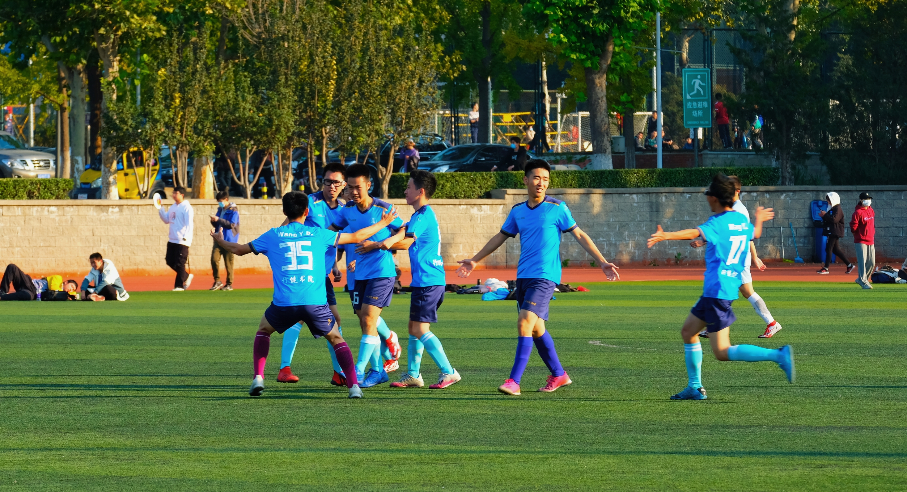

## Life

Besides my passion for robotics, I am deeply devoted to music and sports. They are the sources of my energy.

### 🎵 Music

I am honored to serve as the **Principal Clarinet player** in the Tsinghua University Symphony Orchestra (TUSO). Music is an indispensable part of my life, allowing me to express emotions that equations and code cannot capture. 

Here are two of my favorite performances:

  

    <iframe src="https://player.bilibili.com/player.html?isOutside=true&amp;aid=114743087995363&amp;bvid=BV1NCKEztEPP&amp;cid=30689659635&amp;p=1&amp;autoplay=0" scrolling="no" border="0" frameborder="no" framespacing="0" allowfullscreen="true" style="width: 100%; aspect-ratio: 16/9; border-radius: 8px;"></iframe>
    

      Olé Guapa (Woodwind Quintet)
    

  

  

    <iframe src="https://player.bilibili.com/player.html?isOutside=true&amp;aid=615241636&amp;bvid=BV1Yh4y1g7t7&amp;cid=1173463297&amp;p=1&amp;autoplay=0" scrolling="no" border="0" frameborder="no" framespacing="0" allowfullscreen="true" style="width: 100%; aspect-ratio: 16/9; border-radius: 8px;"></iframe>
    

      Dvořák Symphony No. 8
    

  

<!-- 

  

    <h4 style="text-align: center; margin-bottom: 10px;">Chamber Music: Olé Guapa</h4>
    <iframe src="https://player.bilibili.com/player.html?isOutside=true&amp;aid=114743087995363&amp;bvid=BV1NCKEztEPP&amp;cid=30689659635&amp;p=1" scrolling="no" border="0" frameborder="no" framespacing="0" allowfullscreen="true" style="width: 100%; aspect-ratio: 16/9; border-radius: 8px;"></iframe>
  
 -->

  <!-- 

    <h4 style="text-align: center; margin-bottom: 10px;">TUSO: Dvořák Symphony No. 8</h4>
    <iframe src="https://player.bilibili.com/player.html?isOutside=true&amp;aid=615241636&amp;bvid=BV1Yh4y1g7t7&amp;cid=1173463297&amp;p=1" scrolling="no" border="0" frameborder="no" framespacing="0" allowfullscreen="true" style="width: 100%; aspect-ratio: 16/9; border-radius: 8px;"></iframe>
  

 -->

> **Want to hear more?** > Welcome to visit TUSO's [Bilibili Space](https://space.bilibili.com/111538153?spm_id_from=333.337.0.0)!

---

### ⚽ Sports

During my undergraduate years, I was a main player for the **Xingjian College Soccer Team**. Now, I continue to pursue this passion as a main player for the **Soccer Team of the Department of Mechanical Engineering**. I absolutely love the adrenaline rush of competitive sports and the unbreakable bond built with my teammates on the pitch.

  
  

    
  

  

    

      Upon my undergraduate graduation, my team dedicated a special WeChat article to me, summarizing my memorable moments and the pure passion on the pitch.
    

    <a href="https://mp.weixin.qq.com/s/aSv8F7a3m18oV1Q5PEWweg?scene=1" target="_blank" style="display: inline-block; color: #fff; background-color: #4CAF50; padding: 6px 12px; border-radius: 4px; text-decoration: none; font-size: 13px; font-weight: bold; transition: background-color 0.3s;">
      👉 Read the Story
    </a>
  

<!-- 

  
  

    
  

  

    

      Upon my undergraduate graduation, my team dedicated a special WeChat article to me, summarizing my memorable moments and the pure passion on the pitch.
    

    <a href="https://mp.weixin.qq.com/s/aSv8F7a3m18oV1Q5PEWweg?scene=1" target="_blank" style="display: inline-block; color: #fff; background-color: #4CAF50; padding: 6px 12px; border-radius: 4px; text-decoration: none; font-size: 13px; font-weight: bold; transition: background-color 0.3s;">
      👉 Read the Story
    </a>
  

 -->

<!-- 

  Upon my undergraduate graduation, my team dedicated a special WeChat article to me, summarizing my memorable moments on the pitch. 
  <a href="https://mp.weixin.qq.com/s/aSv8F7a3m18oV1Q5PEWweg?scene=1" target="_blank" style="color: #4CAF50; text-decoration: none; font-weight: bold; margin-left: 5px;">
    👉 Read the Story
  </a>

 -->